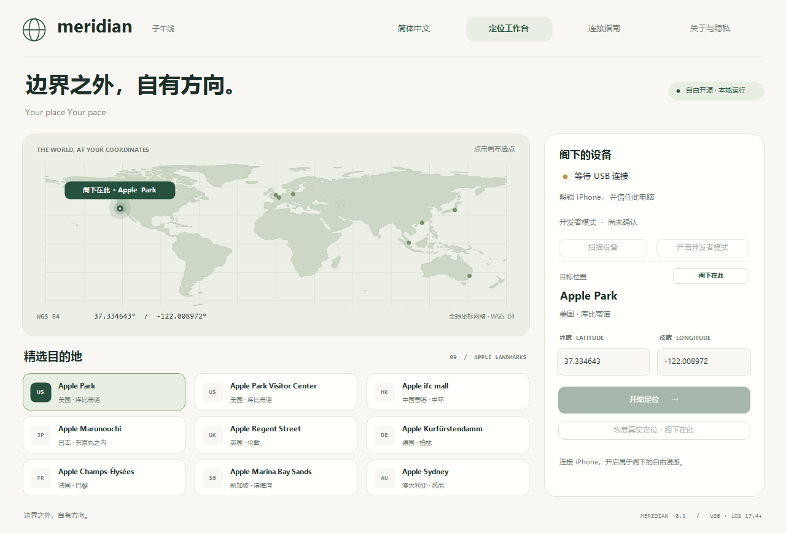
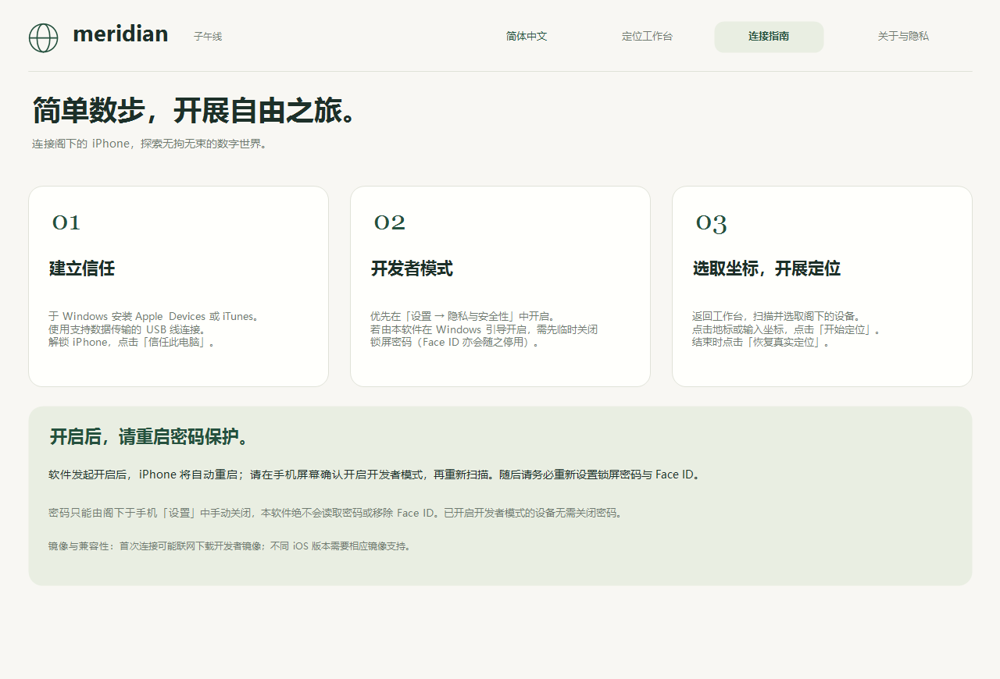
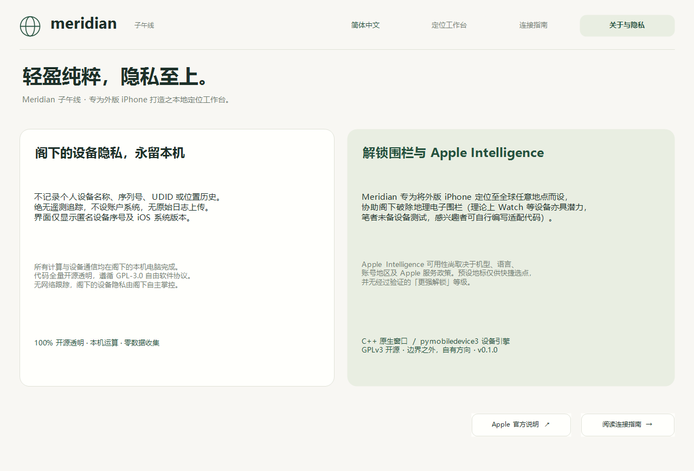

<p align="center">
  <a href="https://github.com/">
    
  </a>
</p>

<h1 align="center">Meridian · 子午線</h1>

<p align="center">
  <strong>邊界之外，自有方向。</strong><br>
  <em>Your place Your pace</em>
</p>

<p align="center">
  <a href="LICENSE"></a>
  <a href="#"></a>
  <a href="#"></a>
  <a href="#"></a>
  <a href="#"></a>
</p>

<p align="center">
  <strong>繁體中文</strong> · <a href="README.zh-CN.md">简体中文</a> · <a href="README.en.md">English</a>
</p>

---

<p align="center">
  
</p>

## 關於項目

**Meridian（子午線）** 是一款面向移動應用開發者與技術研究人員的 iOS 地理位置模擬與開發測試工具。基於 Apple 官方 DVT（Developer Tools）通訊協定構建，旨在協助開發者在 Windows 桌面端便捷調試應用程式在不同地理區域下的 LBS 行為、地圖展示與時區邏輯。

理論上 Apple Watch 等配對裝置亦具同步受益潛力，惟筆者目前未持有 Apple Watch 進行實機驗證，亦未專門撰寫 Watch 相關指令，熱心開發者閣下可參考源碼自行編寫適配代碼。

本项目採用純粹本地化的安全通訊架構，摒棄了 Electron、Qt 及 WebView2 等龐大運行庫，採用 **C++20 + Win32 + GDI+** 構建原生桌面，輔以暖白（`#F8F7F3`）與深林墨綠（`#25513E`）的剋制美學，配備自繪向量地圖與全球 Apple 旗艦地標預設，帶來輕盈、優雅、即開即用的使用體驗。

<details>
  <summary><strong>目錄（點擊展開）</strong></summary>
  <ol>
    <li><a href="#界面一覽">界面一覽</a></li>
    <li><a href="#快速上手">快速上手</a></li>
    <li><a href="#windows-開發者模式配置">Windows 開發者模式配置</a></li>
    <li><a href="#精選全球地標">精選全球地標</a></li>
    <li><a href="#開發測試說明與硬體政策">開發測試說明與硬體政策</a></li>
    <li><a href="#私隱保護與網絡透明度">私隱保護與網絡透明度</a></li>
    <li><a href="#免責聲明與禁止濫用守則">免責聲明與禁止濫用守則</a></li>
    <li><a href="#從源碼構建">從源碼構建</a></li>
    <li><a href="#許可協議與致謝">許可協議與致謝</a></li>
  </ol>
</details>

---

## 界面一覽

| 主控台定位 | 開發者模式引導 | 私隱守則與聲明 |
| :---: | :---: | :---: |
|  |  |  |

---

## 快速上手

### 1. 環境準備
- **操作系統**：Windows 10 或 Windows 11（x64 架構）。
- **驅動環境**：請於 Windows 安裝官方 [Apple Devices（Apple 設備）](https://apps.microsoft.com/detail/9np83lwlpz9k) 應用或最新版 iTunes，以獲取原生通訊驅動。
- **連接線材**：使用支援數據傳輸的原廠或 MFi 認證 USB 數據線。

### 2. 操作步驟
1. 從本倉庫 [Releases](../../releases) 頁面下載最新版 `Meridian-0.1.0-windows-x64.zip`。
2. 將壓縮包**完整解壓**至任意目錄（請保留 `Meridian.exe` 旁邊的 `engine`、`data`、`assets` 等文件夾）。
3. 雙擊啟動 `Meridian.exe`（軟件會自動適配系統語言，亦可點擊右上角語言按鈕自由切換）。
4. 使用 USB 數據線將外版 iPhone 連接至電腦，解鎖手機並在彈出提示中點選**「信任此電腦」**。
5. 確保設備已開啟「開發者模式」（若未開啟，請參考下方引導），點擊軟件中的**「掃描設備」**。
6. 從下拉選單中選取預設地標、點擊「閣下在此」或手動輸入 WGS 84 經緯度，點擊**「開始定位」**。
7. 打開手機內置地圖驗證當前位置。
8. 體驗結束後，點擊**「恢復真實定位 · 閣下在此」**，並在手機地圖中確認已恢復。

---

## Windows 開發者模式配置

有別於 macOS 環境下通常透過 Mac/Xcode 直接配對啟用，在 Windows 平台下，受限於 iOS 底層 AMFI 安全協定，啟用方式如下：

- **方式一：手機直接開啟（強烈推薦）**  
  前往 iPhone「設定 → 私隱與保安 → 開發者模式」手動開啟，並依照系統提示重啟手機確認即可。
- **方式二：由本軟件輔助引導開啟**  
  若手機設定中未顯示開發者模式入口，可透過軟件發起開啟請求。  
  > [!IMPORTANT]
  > 受 iOS 安全握手機制要求，在 Windows 發送啟用請求前，**閣下需先在手機「設定 → 面容 ID 與密碼」中暫時關閉鎖屏密碼**（Face ID 亦會隨之暫時停用）。  
  > **本軟件絕不會讀取、記錄、保存或破解閣下的密碼。**  
  > 發送指令後 iPhone 將自動重啟；重啟後請在手機屏幕彈出的提示中確認**「開啟開發者模式」**，再點擊軟件的「掃描設備」。完成後請務必立即在手機上重新設置鎖屏密碼與 Face ID。已開啟開發者模式的設備無需關閉密碼。

---

## 精選全球地標

| 地區 | 地標名稱 | 緯度 (Latitude) | 經度 (Longitude) | 坐標來源 |
| :--- | :--- | :---: | :---: | :--- |
| **美國** | Apple Park 總部園區 | 37.334643 | -122.008972 | 園區近似地理中心點 |
| **美國** | Apple Park Visitor Center | 37.332890 | -122.005200 | 官方零售店 JSON-LD |
| **香港** | Apple ifc mall | 22.284630 | 114.159172 | 官方零售店 JSON-LD |
| **日本** | Apple Marunouchi | 35.680176 | 139.763855 | 官方零售店 JSON-LD |
| **英國** | Apple Regent Street | 51.514240 | -0.142140 | 官方零售店 JSON-LD |
| **德國** | Apple Kurfürstendamm | 52.503630 | 13.328650 | 官方零售店 JSON-LD |
| **法國** | Apple Champs-Élysées | 48.872217 | 2.301233 | 官方零售店 JSON-LD |
| **新加坡** | Apple Marina Bay Sands | 1.283286 | 103.857547 | 官方零售店 JSON-LD |
| **澳洲** | Apple Sydney | -33.868890 | 151.206780 | 官方零售店 JSON-LD |

> [!NOTE]
> 預設坐標僅供閣下快捷選取代表性位置，各坐標點在協定層面享有同等效果。精確選點請直接輸入 WGS 84 數值。

---

## 開發測試說明與硬體政策

> [!NOTE]
> **官方硬體與服務政策說明**：  
> 依據 [Apple 官方技術政策文檔](https://support.apple.com/zh-hk/121115)，於中國大陸境內購買之 iPhone（硬體型號代碼以 CH/A 結尾之機型）在出廠硬體與入網許可（SKU）層面對部分系統服務存在物理限制。  
> 本工具僅基於 Apple 官方開發者介面進行前端 GPS 坐標模擬調試，**不修改 Apple 帳號所屬地區、不篡改出廠硬體銷售區域，亦無法突破系統級硬體或伺服器端鑑權**。開發者在進行跨區域應用測試時，請知悉相關官方硬體與服務政策限制。

1. **工作原理與局限**：本項目透過標準 DVT 協定修改設備回報之底層 GPS 模擬坐標，屬於標準調試能力。
2. **區域服務可用性**：特定系統級功能（如 Apple Intelligence）的啟用取決於設備晶片（如 A17 Pro、M 系列等）、操作系統版本、系統語言、Siri 語音設置及 Apple 官方服務授權等多重因素。**模擬 GPS 坐標不代表亦不承諾可以解開受限的系統服務**。
3. **系統版本適配**：核心通訊協定面向 **iOS 17.4 至 iOS 27+**，固定採用經過充分驗證的 `pymobiledevice3 11.12.5` RSD / DVT 通訊架構。
4. **位置恢復機制**：正常關閉視窗或點擊「恢復真實定位 · 閣下在此」時，程序會主動清除模擬狀態。若遇異常斷開、崩潰或程序被強制終止，請重新連接後點擊恢復，或重啟 iPhone 即可重置。

---

## 私隱保護與網絡透明度

- **零遙測與本地優先**：不記錄閣下設備名稱、序號、UDID、位置軌跡或異常崩潰日誌；軟件不設任何後台常駐、後門或隱式數據上報機制。
- **進程記憶體隔離**：設備通訊識別碼僅在後台進程中臨時使用，界面前端僅透過隨機臨時憑證交互，不落盤、不寫入日誌。
- **網絡與通訊透明度**：所有位置修改均在閣下電腦與本機手機之間的 USB 數據通道內完成。
  - 首次啟用開發者鏡像（DDI）時，可能需連接 Apple 官方伺服器安全獲取匹配之簽名鏡像。
  - 當點擊「閣下在此」獲取當前參考坐標時，程序會向公開 IP 地理庫發起唯讀 HTTPS 查詢以填充經緯度，不傳輸任何設備硬體識別碼，亦不記錄任何定位日誌。

---

## 免責聲明與禁止濫用守則

> [!IMPORTANT]
> 本項目為開源的移動開發測試與技術研究工具，嚴格遵循技術中立原則。

1. **用途限制**：本項目僅供移動應用開發者進行 LBS 場景調試、跨區域地圖業務測試、以及逆向工程與底層通訊協定的學術研究。
2. **嚴禁非法與違規濫用**：使用者不得將本軟件用於任何違反法律法規、侵犯第三方合法權益或破壞公平競爭的行為，包括但不限於：
   - 網約車、貨運、即時配送等商業運營平台的虛假接單、搶單、刷單與調度欺詐；
   - 企事業單位各類移動考勤軟件的虛假定位與考勤打卡欺詐；
   - 破壞網絡遊戲公平競爭環境的外掛輔助、作弊或多開刷取利益行為；
   - 故意規避監管政策、侵犯任何第三方商業合同或服務條款（TOS）的行為。
3. **責任豁免**：項目作者與貢獻者不對任何個人或組織因直接或間接使用、傳播本軟件所導致的任何法律糾紛、行政處罰、帳號封禁、數據損失或硬體故障承擔任何民事或刑事連帶責任。**下載、克隆、編譯或運行本軟件，即視為您已完全閱讀、理解並同意遵守本守則。**

---

## 從源碼構建

### 1. WSL 交叉編譯 C++ 前端
推薦在 Ubuntu 24.04 (WSL 2) 下使用 MinGW-w64 交叉編譯生成 Windows 原生二進制：

```bash
sudo apt-get update
sudo apt-get install -y g++-mingw-w64-x86-64-posix cmake ninja-build
cd /mnt/c/path/to/meridian
bash scripts/build-wsl.sh
```
編譯產物將輸出至 `.build/windows/Meridian.exe`，已靜態鏈接標準庫，無任何第三方 UI 運行環境依賴。

### 2. Windows 凍結 Python 引擎與打包便攜包
在 Windows PowerShell (Python 3.12 x64) 環境下：

```powershell
py -3.12 -m venv .build/venv
.build/venv/Scripts/python.exe -m pip install -r requirements-lock.txt pyinstaller==6.19.0
.build/venv/Scripts/python.exe -m unittest discover -s tests -v
./scripts/package.ps1 -Python .build/venv/Scripts/python.exe
```

打包腳本會自動完成：
- 執行全量單元測試與原生 UI 自動化測試；
- 凍結後端引擎至 `release/Meridian/engine`；
- 執行敏感資訊與私隱安全自動化審計；
- 生成便攜版 ZIP、源代碼 ZIP 及對應的 SHA256 校驗清單。

---

## 許可協議與致謝

- 本項目採用 **[GPL-3.0-or-later](LICENSE)** 許可協議開源。
- 底層 iOS 通訊協定基於 [pymobiledevice3](https://github.com/doronz88/pymobiledevice3)（GPL-3.0）。
- 輕量 JSON 解析採用 [nlohmann/json](https://github.com/nlohmann/json)（MIT）。
- 本項目為獨立開源研究工具，與 Apple Inc. 無任何官方關聯或商業隸屬。
